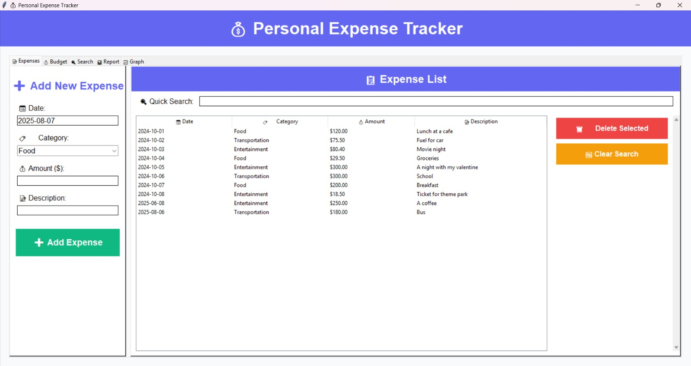
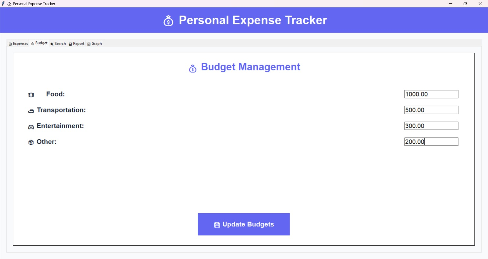
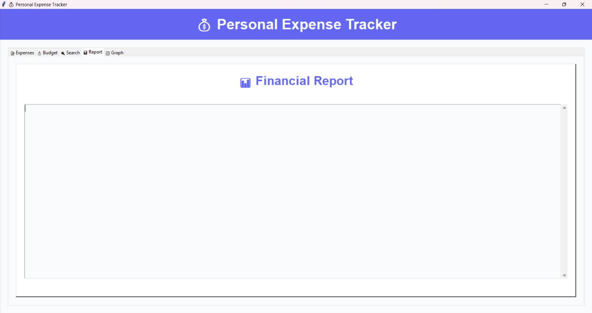

# 💰 Personal Expense Tracker


A modern Python application for personal finance management featuring intuitive GUI, data analysis tools, and interactive visualizations.

## ✨ Key Features

- 📝 **Expense Tracking**: Log daily expenses with categories
- 📊 **Budget Analysis**: Compare spending against budgets
- 📈 **Data Visualization**: Interactive charts using Turtle
- 🔍 **Advanced Search**: Filter by date, category, and amount
- 📁 **Data Persistence**: All data saved in TXT files
- 🎨 **Modern UI**: Professional color scheme and responsive design

## 🖼️ Screenshots

|  |  |
|---------------------------------|--------------------------------|
|   |  |

## 🛠️ Tech Stack
- **Language**: Python 3.8+
- **GUI Framework**: Tkinter
- **Data Visualization**: Turtle Graphics
- **Data Storage**: Plain-text files

## 🛠️ Installation

1. **Requirements**:
   - Python 3.8+
   - Built-in libraries: `tkinter`, `turtle`

2. **Setup**:
   ```bash
   git clone https://github.com/your-username/personal-expense-tracker.git
   cd personal-expense-tracker
   python gui_app.py

   📚 Project Structure

personal-expense-tracker/
├── gui_app.py            # Main GUI application
├── project.py            # CLI version
├── expenses.txt          # Expense records
├── budget.txt            # Budget allocations
├── .gitignore
├── requirements.txt
└── docs/
    ├── design.md
    ├── setup_guide.md
    └── api_reference.md
├── README.md             # This document
└── screenshots/          # Application screenshots

🧩 User Guide
📝 Adding Expenses
Navigate to "Expenses" tab

Enter date, category, amount, and description

Click "Add Expense"

💰 Budget Management
Open "Budget" tab

Modify budget amounts for each category

Click "Update Budgets"

📊 Generating Reports
Switch to "Report" tab

Click "Generate Report"

View spending analysis and budget comparisons

🧠 Technical Details
Data Structure
python
{
  "date": "YYYY-MM-DD",
  "category": "Food|Transportation|Entertainment|Other",
  "amount": float,
  "description": string
}
Architecture
MVC Pattern: Model (TXT files), View (Tkinter), Controller (gui_app.py)

Modular Code: Each tab managed by separate methods

Error Handling: All file operations protected with try-except blocks

## 🚀 Future Enhancements
- [ ] Database integration (SQLite)
- [ ] PDF report generation
- [ ] Mobile responsive version

🌟 Contributing
We welcome contributions! Here's how:

Fork the repository

Create a feature branch (git checkout -b feature/improvement)

Commit your changes (git commit -m 'Add new feature')

Push to the branch (git push origin feature/improvement)

Open a Pull Request

📜 License Explained
This project uses the MIT License - one of the most common open-source licenses. Here's what it means:

✅ You can:

Use the code commercially

Modify and distribute it

Use privately

Place your own warranty

❌ You must:

Include the original license

Not hold the author liable

🔓 You cannot:

Sue the original author for problems with the software

The full text is available in the LICENSE file.

✉️ Contact
For inquiries: utkyilmz@gmail.com

